# Kinetic QR

  


Kinetic QR is a comprehensive QR code generation and scanning app for **Android** and **iOS** platforms. Whether you need to create a QR code for sharing contact details, Wi-Fi credentials, websites, or even social media profiles, Kinetic QR provides advanced features and control to meet your needs. With an efficient QR scanner and customizable settings, Kinetic QR enhances your experience in generating, sharing, and scanning QR codes.

## 🚀 Features

### 🖼️ QR Code Generation
Easily generate QR codes for different use cases, including:
- **Contact Information**
- **WhatsApp** links
- **Wi-Fi Credentials**
- **Websites**
- **Gmail** actions (like sending an email)
- **Instagram** profiles
- **Plain Text**

#### ⚙️ Advanced Settings for QR Creation:
- **Error Correction Level**: Control the error correction level (L, M, Q, H) to make your QR codes more robust.
- **Embedded Image**: Customize your QR code with an embedded image, such as a logo or icon.

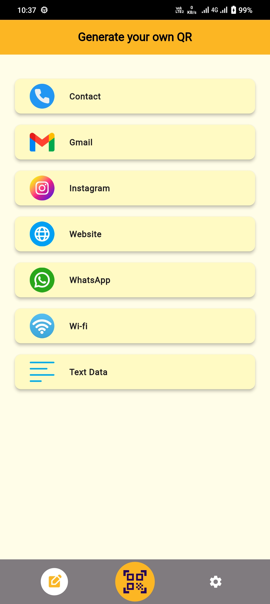&nbsp;&nbsp;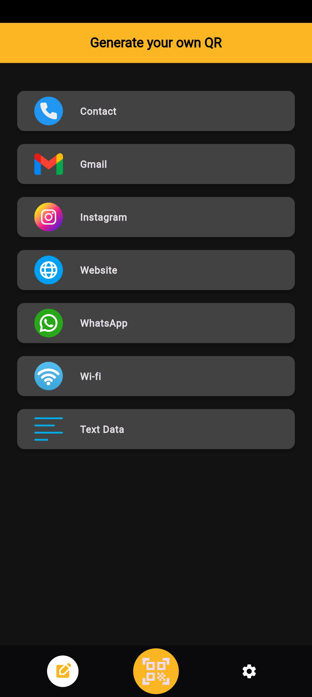

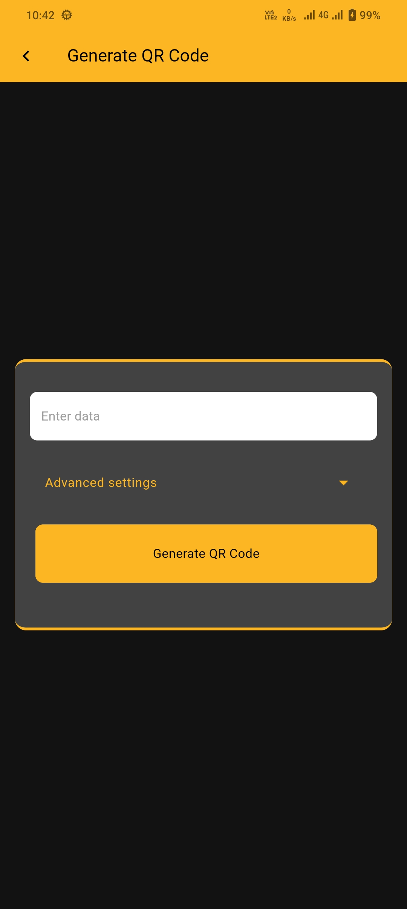&nbsp;&nbsp;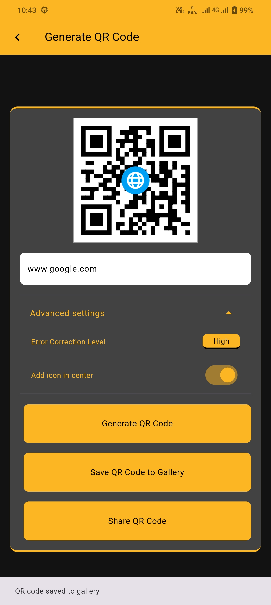&nbsp;&nbsp;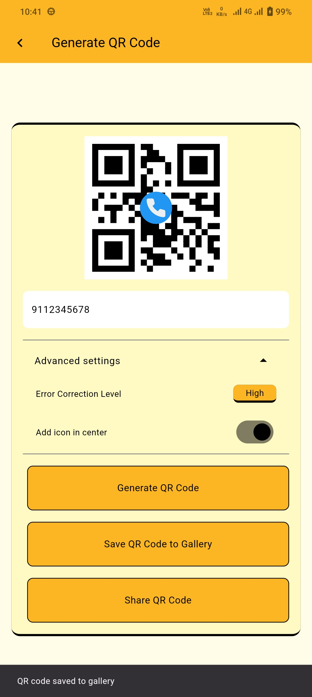


### 📤 QR Code Sharing
- Save generated QR codes as **PNG images** in your gallery.
- Directly share the generated QR codes across different platforms (social media, email, etc.).

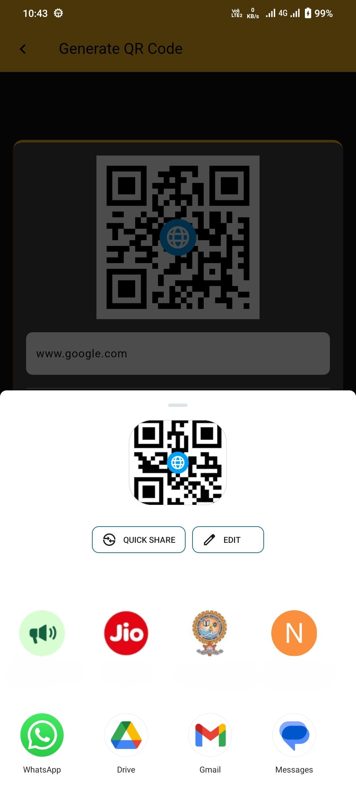

### 📷 QR Code Scanning
Kinetic QR features an advanced and intuitive QR code scanner:
- **Camera Controls**: Easily control the camera with features like flipping between front and rear cameras, enabling or disabling flash, and auto-focusing.
- **Zoom Functionality**: Zoom in or out while scanning to capture QR codes from different distances.
- **Scan from Gallery**: Select images from your gallery to scan QR codes embedded in the image.

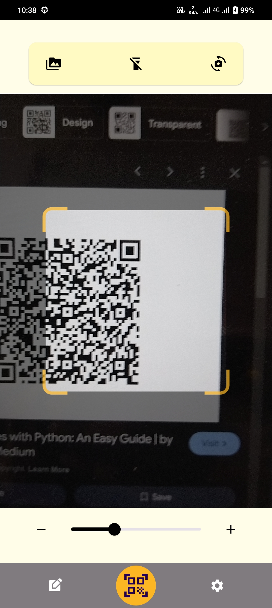&nbsp;&nbsp;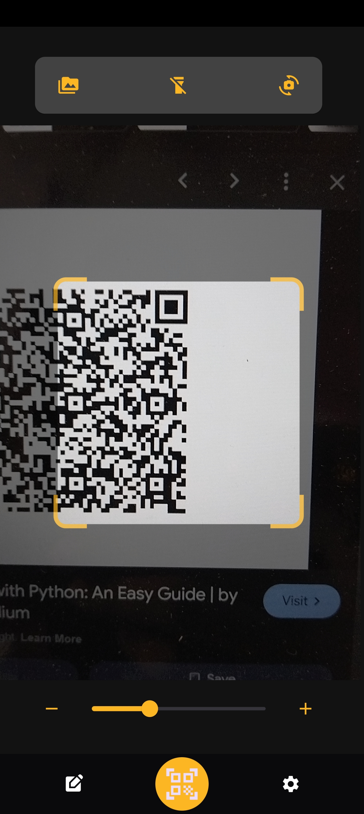

### Scan Results Handling
- **Copy to Clipboard**: Instantly copy the scanned result to your clipboard for later use.
- **Open URLs in Browser**: If the scanned QR code contains a URL, the app provides a direct option to open it in your default browser.

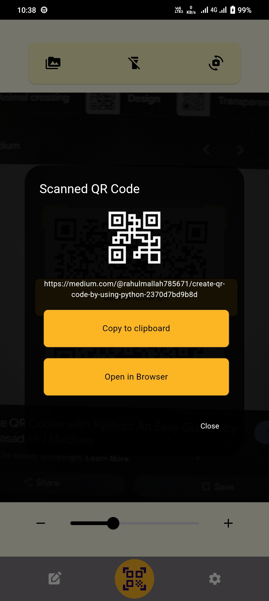

### 🎨 Themes & Customization
- Dual theme support: **Light Mode** and **Dark Mode** to provide an optimal user experience.
- **Customize Default Page**: Set the QR scanner as the default page when the app opens.
- **Vibration on Success**: Enable or disable the vibration feedback on a successful QR scan.

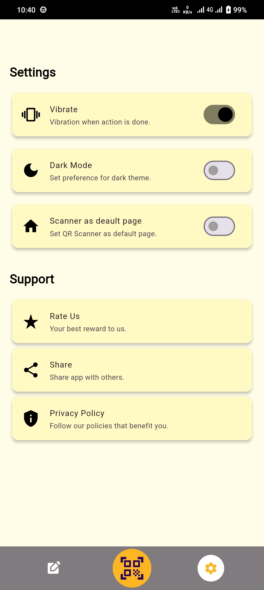&nbsp;&nbsp;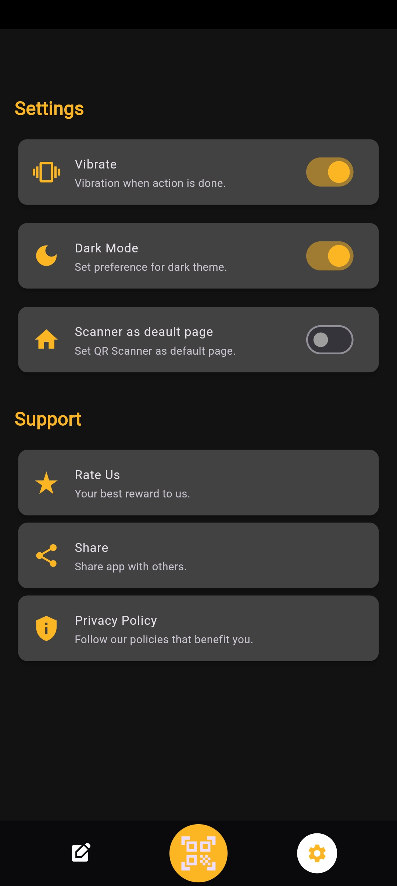

### 🗂️ Settings & Storage
- Store user preferences, like theme, default page, and vibration settings, using **Shared Preferences** to retain settings between app sessions.
- All successes and failures are displayed with user-friendly **Snackbars**.

## 📦 Packages Used

This project utilizes the following Flutter packages to enhance functionality:

- [`flutter_screenutil`](https://pub.dev/packages/flutter_screenutil) `^5.9.3`: For adapting screen size and font size to different devices.
- [`qr_code_scanner`](https://pub.dev/packages/qr_code_scanner) `^1.0.0`: For scanning QR codes through camera input.
- [`url_launcher`](https://pub.dev/packages/url_launcher) `^6.3.0`: For launching URLs in a browser.
- [`qr_flutter`](https://pub.dev/packages/qr_flutter) `^4.1.0`: For generating QR codes within the app.
- [`share_plus`](https://pub.dev/packages/share_plus) `^8.0.0`: To allow users to share content with other apps.
- [`path_provider`](https://pub.dev/packages/path_provider) `^2.1.4`: For accessing commonly used locations on the filesystem.
- [`shared_preferences`](https://pub.dev/packages/shared_preferences) `^2.3.2`: For storing app settings and preferences.
- [`image_picker`](https://pub.dev/packages/image_picker) `^1.1.2`: To pick images from the gallery.
- [`provider`](https://pub.dev/packages/provider) `^6.1.2`: For managing state of theme mode in the app.
- [`permission_handler`](https://pub.dev/packages/permission_handler) `^11.3.1`: For requesting and managing app permissions eg. Camera.
- [`gallery_saver`](https://pub.dev/packages/gallery_saver) `^2.3.2`: For saving generated QR codes to the device gallery.
- [`scan`](https://pub.dev/packages/scan) `^1.6.0`: For scanning QR codes from static images.
- [`vibration`](https://pub.dev/packages/vibration) `^2.0.0`: For vibrating the device on successful QR scans.

## 🏁 Getting Started

### ✅ Prerequisites
Before you begin, ensure you have the following:
- Flutter SDK
- Android Studio/ VS Code or Xcode (for iOS development)

### 🔧 Installation
- Clone the repository:
   ```bash
   git clone https://github.com/quant-1729/kineticqr.git
- Navigate to the project directory:
   ```bash
   cd kinetic-qr
- Install the required dependencies:
   ```bash
   flutter pub get
- Run the app:
   ```bash
   flutter run

## 📂 App Structure

- **lib/**: The main source code directory containing widgets, providers, utils and views.
  - **widgets/**: Contains all reusable widgets like QR result dialog, custom buttons, navbar etc.
  - **utils/**: Utility classes for colors, themes, styles and constants.
  - **views/**: Contains the main screens like QR Generation screen, QR Scanner screen, and Settings screen.
  - **provider/**: Contains the Provider for Theme Mode.

## 🛣️ Roadmap

- Add support for additional QR code types like **SMS**, **Event**, and **Geo-location**.
- Implement a **history feature** to track previously scanned or generated QR codes.

## 🤝 Contributing

Contributions are welcome! Please follow these steps to contribute:

1. Fork the repository.
2. Create your feature branch (`git checkout -b feature/YourFeature`).
3. Commit your changes (`git commit -m 'Add your feature'`).
4. Push to the branch (`git push origin feature/YourFeature`).
5. Open a pull request.

## 📜 License

This project is licensed under the MIT License - see the [LICENSE](LICENSE) file for details.
